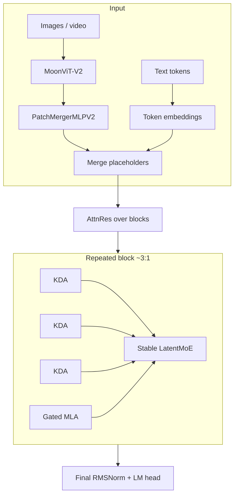

# Kimi K3 Architecture (Code + Report Synthesis)

This document synthesizes Moonshot AI’s **Kimi K3 technical report**, Hugging Face
`custom_code`, and related open kernels so you can read the Python sources and the
multilingual reference ports with a single mental model.

Primary official code: `../official/python/`  
Tech report PDF: `../official/reports/k3_tech_report.pdf`  
Float32 educational core: `../reference/python/kimi_k3_ref/`

---

## 1. What Kimi K3 Is

| Property | Value |
|----------|------:|
| Total parameters | 2.8T |
| Activated parameters | ~104B |
| Layers | 93 |
| Hidden size | 7168 |
| Attention heads | 96 |
| KDA head dim | 128 |
| Routed experts | 896 |
| Experts per token | 16 |
| Shared experts | 2 |
| Latent MoE dim | 3584 |
| Expert intermediate | 3072 |
| Vocabulary | 163840 |
| Context length | 1 048 576 |
| Activation | SiTU-GLU (`situ`) |
| Vision encoder | MoonViT-V2 (~401M) |
| Weight quant (deploy) | MXFP4 (QAT) |

K3 scales information flow along three axes (report §2):

1. **Sequence length** — Hybrid Attention (KDA + Gated MLA)
2. **Depth** — Attention Residuals (AttnRes)
3. **Width** — Stable LatentMoE

plus a **native vision** pathway into the shared embedding space.



---

## 2. Hybrid Attention Schedule

Config lists in `config.json` → `text_config.linear_attn_config` are **1-indexed**.
Code uses 0-based `layer_idx` and checks `(layer_idx + 1) in kda_layers`
(`KimiLinearConfig.is_kda_layer`).

Pattern: **KDA, KDA, KDA, MLA** repeated. Layers **92 and 93** are both MLA
(extra final global attention). Totals: **69 KDA + 24 Gated MLA**.

| Layer type | Module | Cache |
|------------|--------|-------|
| KDA | `KimiDeltaAttention` | short-conv states + recurrent state `S` |
| MLA | `KimiMLAAttention` | compressed KV cache |

Masking: linear layers use a 2-D padding mask (or none when fully dense);
MLA uses a standard causal mask / FlashAttention-2.

---

## 3. Kimi Delta Attention (KDA)

### 3.1 Recurrence (report eq. 1 / FLA naive)

For each head (educational form with `HV == H`):

\[
S_t = (I - \beta_t k_t k_t^\top)\,\mathrm{Diag}(\alpha_t)\,S_{t-1} + \beta_t k_t v_t^\top
\]
\[
\tilde{o}_t = S_t^\top q_t
\]

Equivalent FLA `naive_recurrent_kda` update (log-space gate `g = log α`):

```text
S ← S * exp(g_t)
δ ← v_t − (k_t · S)          # contraction over key dim
S ← S + (β_t * k_t) ⊗ δ
o_t ← q_t · S
```

Implemented educationally in `reference/.../kda_recurrent.py` and all language ports.

### 3.2 Parameterization (official `KimiDeltaAttention`)

1. `q,k,v = Linear(x)` then **ShortConvolution (k=4) + SiLU**
2. L2-normalize `q` and `k` inside the kernel (`use_qk_l2norm_in_kernel=True`)
3. `β = sigmoid(b_proj(x))`
4. Gate logits from low-rank `f_b_proj(f_a_proj(x))` + `dt_bias`, then
   **lower-bound gate** (K3):
   `g = lower_bound * sigmoid(exp(A_log) * (logits + dt_bias))` with `lower_bound=-5`
5. Prefill: `chunk_kda` (FLA Triton or FlashKDA CUTLASS); decode step: `fused_recurrent_kda`
6. Output: `FusedRMSNormGated(o, g_proj(x))` then `o_proj`

See `official/fla_kda/naive.py`, `official/fla_kda/gate.py`, `official/flashkda/`.

---

## 4. Gated MLA

Adapted from DeepSeek-V3 MLA with K3 additions:

- LoRA-style compress: `q_lora_rank=1536`, `kv_lora_rank=512`
- `qk_nope_head_dim=128`, `qk_rope_head_dim=64`, `v_head_dim=128`
- `mla_use_nope=True` (RoPE path present in tensors; K3 asserts nope usage flag)
- **Output gate**: `attn_out *= sigmoid(g_proj(x))` when `mla_use_output_gate=True`

Educational eager path: `mla_eager.py` / language ports (no FlashAttention).

---

## 5. Attention Residuals (AttnRes)

Standard residuals compress history into one state. AttnRes lets each module
**soft-select** among the embedding and prior **block summaries**.

K3 uses **block AttnRes** with `attn_res_block_size=12`:

- Within a block, layer outputs accumulate as `prefix_sum`.
- Every `block_size` layers, `prefix_sum` is appended to `block_residual`.
- `_apply_attn_res` concatenates `[block_residual || prefix_sum]`, RMSNorms values,
  scores with `norm.weight * proj.weight` (pseudo-query), softmax, weighted sum.

Code: `modeling_kimi_linear.py` → `_apply_attn_res`,
`KimiDecoderLayer._forward_attn_residual`,
`KimiLinearModel._apply_output_attn_res`.

Educational: `attn_res.py`, `decoder_block.py`.

---

## 6. Stable LatentMoE + SiTU-GLU

### Router (`KimiMoEGate`)

```text
logits = x @ Wᵀ
scores = sigmoid(logits)
choice = scores + e_score_correction_bias
topk_idx = topk(choice, k=16)
topk_weight = gather(scores, topk_idx)
topk_weight = renormalize(topk_weight) * routed_scaling_factor
```

Educational ports use a **deterministic top-k** (ties → smaller index; indices sorted).
Official `torch.topk(..., sorted=False)` is not cross-backend deterministic — see `NUMERICS.md`.

### Latent path (`KimiSparseMoeBlock`)

```text
y = down_proj(x)           # H → 3584
y = MoE_experts(y)         # top-16 of 896, each SiTU-GLU FFN (inter=3072)
y = RMSNorm(y); y = up_proj(y)
y = y + shared_experts(x)  # 2 shared experts fused as one wide MLP
```

Layer 0 is dense MLP (`first_k_dense_replace=1`); thereafter MoE every layer
(`moe_layer_freq=1`).

### SiTU-GLU (`SituAndMul`)

```text
gate, up = split(x)
a = β * tanh(gate/β) * sigmoid(gate)     # β=4
up = β_lin * tanh(up/β_lin)              # β_lin=25
return a * up
```

---

## 7. Multimodal Path (MoonViT-V2)

`modeling_kimi_k3.py` / `KimiK3ForConditionalGeneration`:

1. Vision tower encodes images (patch 14, 27 ViT layers, hidden 1024)
2. `PatchMergerMLPV2` projects to text hidden 7168
3. Features replace `<|kimi_image_placeholder|>` token slots in the sequence
4. Backbone (`KimiLinearForCausalLM`) runs as usual

Chat/tool formatting uses XTML-style encoding in `encoding_k3.py` and
`tokenization_kimi.py` (TikToken-based).

---

## 8. How to Read This Repo

1. Skim this file and `SOURCE_MAP.md`
2. Read `official/python/modeling_kimi_linear.py` (backbone) then `modeling_kimi_k3.py` (multimodal)
3. Compare each op to `reference/python/kimi_k3_ref/`
4. Pick a language under `c/`, `cpp/`, `rust/`, or `go/` — same fixtures in `fixtures/goldens.json`
5. Run `scripts/verify_all.sh`

Weights are **not** included; this tree teaches **how the code works**, not how to host 2.8T.
